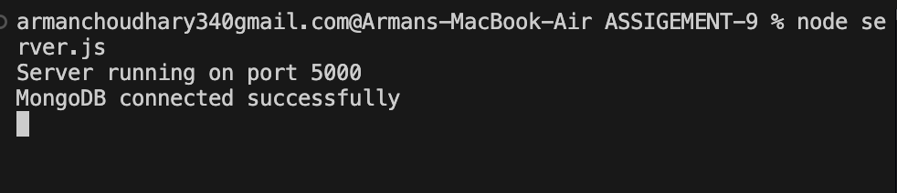
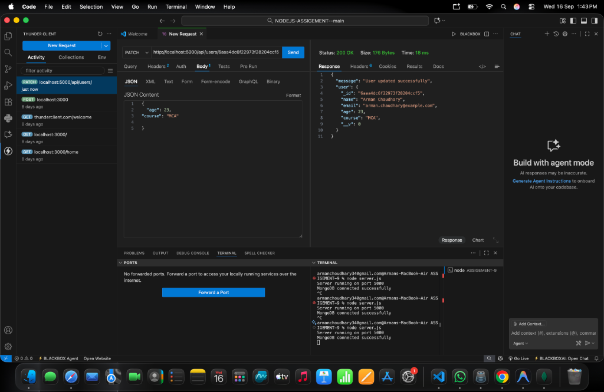
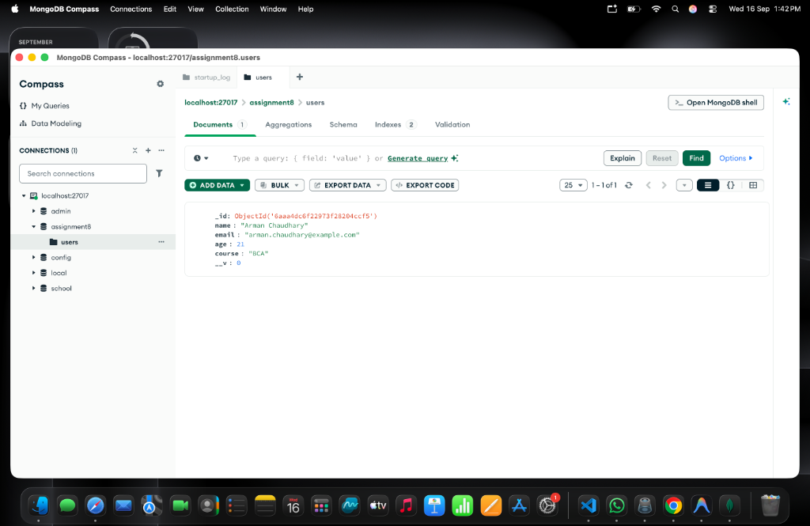
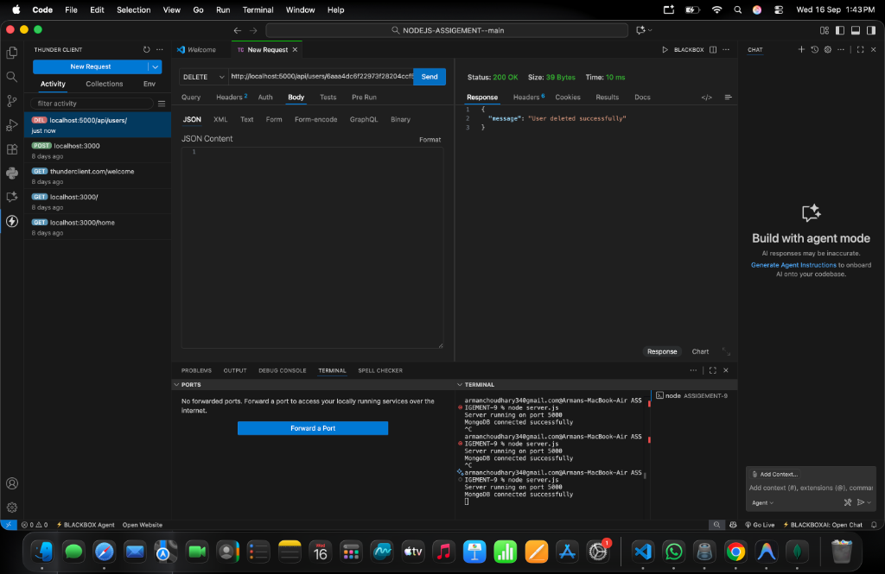
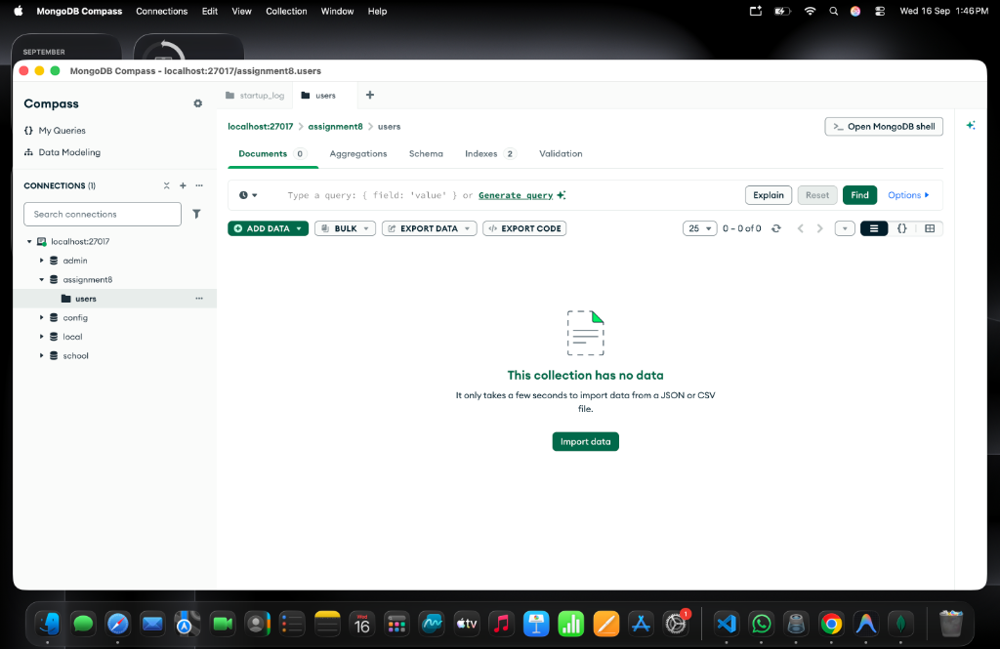

# User Management API (POST, GET, PATCH & DELETE)

## Assignment 9

An Express.js and MongoDB REST API implementing **Create (POST)**, **Read (GET)**, **Update (PATCH)**, and **Delete (DELETE)** operations using Mongoose, organized with a clean modular MVC-style architecture.

## Project Structure

```text
ASSIGEMENT-9/
├── model/
│   └── userModel.js          # Mongoose model compiled from userSchema
├── router/
│   └── userRouter.js         # Express router handling CRUD endpoints
├── schema/
│   └── userSchema.js         # Mongoose schema definition with validation rules
├── SCREENSHOT/               # Execution screenshots for server, API tests, and DB
│   ├── 1_server_startup.png
│   ├── 2_patch_user_api.png
│   ├── 3_compass_updated_user.png
│   ├── 4_delete_user_api.png
│   └── 5_compass_deleted_user.png
├── package.json              # Project configuration and dependencies
├── package-lock.json         # Locked dependency tree
├── server.js                 # Application entry point and database connection
└── README.md                 # Project documentation
```

---

## API Endpoints & Examples

### 1. Create User (`POST /api/users`)
**Request:**
- **Method:** `POST`
- **URL:** `http://localhost:5000/api/users`
- **Body (JSON):**
```json
{
  "name": "Arman Chaudhary",
  "email": "arman.chaudhary@example.com",
  "age": 21,
  "course": "BCA"
}
```

**Response (`201 Created`):**
```json
{
  "message": "User created successfully",
  "user": {
    "name": "Arman Chaudhary",
    "email": "arman.chaudhary@example.com",
    "age": 21,
    "course": "BCA",
    "_id": "<user_id>",
    "__v": 0
  }
}
```

---

### 2. Get All Users (`GET /api/users`)
**Request:**
- **Method:** `GET`
- **URL:** `http://localhost:5000/api/users`

**Response (`200 OK`):**
```json
{
  "message": "Users fetched successfully",
  "users": [
    {
      "_id": "<user_id>",
      "name": "Arman Chaudhary",
      "email": "arman.chaudhary@example.com",
      "age": 21,
      "course": "BCA",
      "__v": 0
    }
  ]
}
```

---

### 3. Update User (`PATCH /api/users/:id`)
**Request:**
- **Method:** `PATCH`
- **URL:** `http://localhost:5000/api/users/<user_id>`
- **Body (JSON):**
```json
{
  "age": 23,
  "course": "MCA"
}
```

**Response (`200 OK`):**
```json
{
  "message": "User updated successfully",
  "user": {
    "_id": "<user_id>",
    "name": "Arman Chaudhary",
    "email": "arman.chaudhary@example.com",
    "age": 23,
    "course": "MCA",
    "__v": 0
  }
}
```

---

### 4. Delete User (`DELETE /api/users/:id`)
**Request:**
- **Method:** `DELETE`
- **URL:** `http://localhost:5000/api/users/<user_id>`

**Response (`200 OK`):**
```json
{
  "message": "User deleted successfully"
}
```

---

## Screenshots

### 1. MongoDB Connection and Server Startup
Server running on port 5000 with MongoDB connected successfully.



---

### 2. Update User API (PATCH Request)
Thunder Client testing `PATCH /api/users/:id` returning status `200 OK` and updated user data.



---

### 3. MongoDB Compass Verification (Updated User)
MongoDB Compass showing the user document in `assignment8` database -> `users` collection.



---

### 4. Delete User API (DELETE Request)
Thunder Client testing `DELETE /api/users/:id` returning status `200 OK` with confirmation message.



---

### 5. MongoDB Compass Verification (Deleted User)
MongoDB Compass confirming document removal from the collection (`0 documents` / no data).


